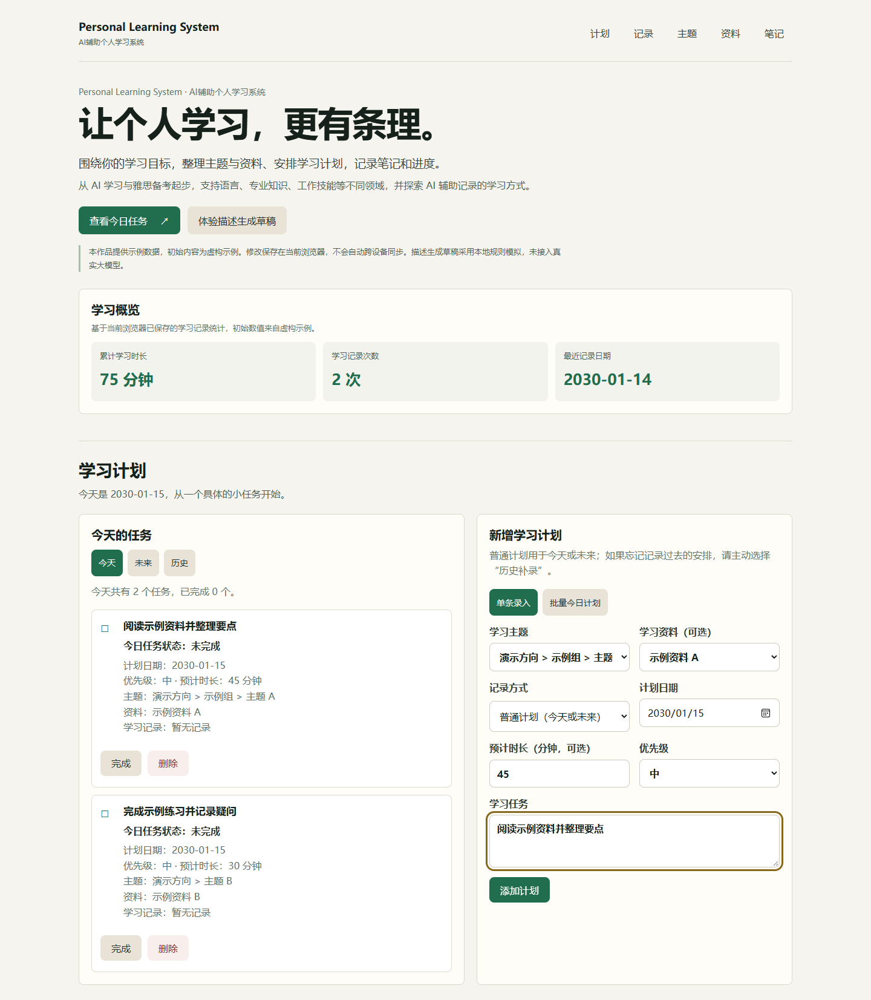
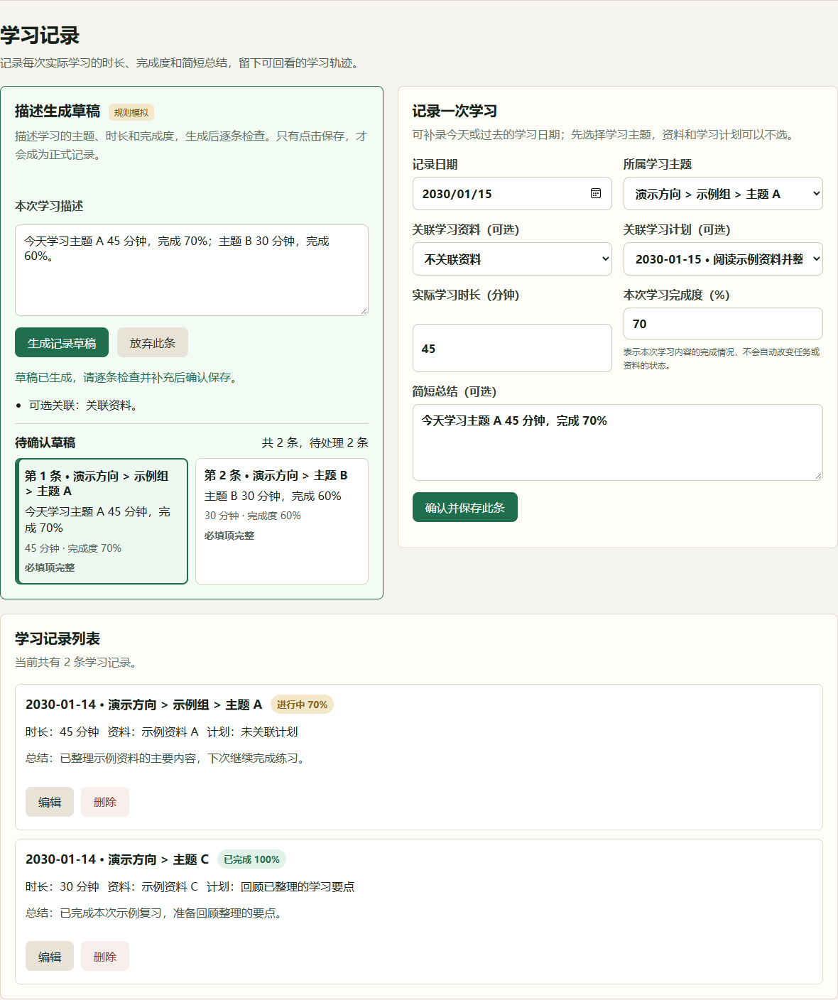

# Personal Learning System（AI辅助个人学习系统）

围绕你的学习目标，整理主题与资料、安排学习计划，记录笔记和进度。

这是一个面向不同学习领域的个人学习工作台，支持语言学习、专业知识、工作技能等个人学习目标。项目从 AI 学习与雅思备考起步，逐步演变为通用个人学习系统；AI 辅助记录是持续探索的特色。应用使用 HTML、CSS 和 JavaScript，数据保存在当前浏览器。

> 初始内容为虚构示例。描述生成草稿采用本地规则模拟，未接入真实大模型；本项目不提供登录和云同步。

当前版本已完成公开作品展示版改造，以下功能均可在本地体验。各版本的设计、实现和验收过程保留在[项目演进记录](docs/project-status.md)中。

## 界面预览

以下两张截图使用独立临时浏览器中的**通用虚构演示数据，并非作者个人学习记录**。主题、资料和任务均为示例；浏览器日期固定模拟为 **2030-01-15**，其中的日期、时长与完成度仅用于展示流程，不代表真实学习成果。

首页工作台：产品介绍、学习概览、通用示例任务与计划录入。



AI 辅助记录草稿确认流程：当前通过本地规则识别“主题 A／B”，生成两条待确认草稿，逐条检查后再保存。



截图数据仅用于公开展示。产品首次打开时仍提供原有完整 Demo；下面的“三分钟体验”示例对应实际 Demo，而非截图中的主题名称。首页关于 AI 学习与雅思备考的文字说明项目起点，不是截图中的学习记录。

## 为什么做这个项目

同时学习 AI 与雅思时，学习资料、当天计划和实际学习记录容易分散：收藏了资料，却不知道今天应该完成哪一部分；花了时间学习，却没有留下可回看的过程。

这是我的第一个 Codex 项目。从自己的学习需求出发，逐步建立主题、资料、计划、笔记和学习记录之间的关联。随着自定义学习方向等能力完善，项目已经拓展为服务不同领域的个人学习系统。AI 学习是项目的起点，“描述一次学习，确认后再保存”是 AI 辅助记录的探索方向；当前的 AI 与雅思内容用于示例体验，用户可以建立自己的学习方向。

## 已实现的能力

| 模块 | 能做什么 |
| --- | --- |
| 学习主题 | 新建、编辑、自定义方向、父子层级、同级排序、归档与恢复 |
| 学习资料 | 保存基础信息、关联主题、编辑、删除和维护资料整体状态 |
| 学习计划 | 单条或多主题批量录入今日计划，查看今天、未来和历史任务，历史补录及完成状态切换 |
| 学习记录 | 记录时长、完成度和简短总结，关联资料或计划，补录过去日期、编辑和删除 |
| 学习笔记 | 记录理解与疑问，关联主题、资料和计划，查看、编辑和删除 |
| 描述生成草稿 | 通过本地规则将描述拆为多条可编辑草稿，逐条确认保存或放弃 |

## 三分钟体验

在没有本站数据的浏览器环境中首次打开项目，即可看到完整示例：4 个主题、3 份资料、4 个计划、2 条笔记和 2 条学习记录。

1. 点击“查看今日任务”，查看提示词练习与雅思阅读两个待完成任务。
2. 点击“体验描述生成草稿”，输入下面的示例。
3. 检查两条草稿的主题、时长、完成度和关联计划，可以自行修改。
4. 逐条点击“确认并保存此条”。生成草稿本身不会保存正式记录。
5. 查看学习记录列表和顶部概览；两条均保存后，初始 75 分钟、2 条记录变为 150 分钟、4 条记录。

```text
今天学习 Prompt Engineering 45 分钟，完成 70%；雅思阅读练习 30 分钟，完成 60%。
```

示例主题与输入示例相互匹配。资料是可选关联，未在描述中指明时可以留空。若修改了主题名称或删除了关联内容，需要根据提示手动选择。

## 本地运行与测试

### 使用应用

下载或克隆项目后，在浏览器中打开根目录的 `index.html`。运行页面不需要 Node.js、安装依赖或 API Key。浏览器需要允许本地存储；若打开本地文件时限制了存储，可通过本地静态 HTTP 服务访问同一目录。

不同浏览器、浏览器配置和访问地址的存储相互独立。例如，本地文件与 HTTP 地址不会自动共享数据。不要把切换地址后的空环境理解为原数据已被删除。

### 自动测试

测试使用 Node.js 内置测试工具与 Playwright。安装 Node.js（附带 npm）后，在项目目录准备测试依赖：

```sh
npm install --no-save --package-lock=false playwright
npx playwright install chromium
npm test
```

Playwright 仅用于开发测试，不会在产品页面中加载。也可以使用已安装的 Microsoft Edge；Windows PowerShell 示例：

```powershell
$env:EDGE_EXE = 'C:\Program Files (x86)\Microsoft\Edge\Application\msedge.exe'
npm test
```

请按实际安装位置设置 `EDGE_EXE`。使用 Edge 时仍需安装 Playwright 包，但不必再下载 Chromium。

`npm test` 执行的是 `node --test tests/*.test.cjs`。公开展示版的验证环境为 Node.js 24、Playwright 1.62.1 和 Microsoft Edge；由于执行环境没有 npm，使用了相同的 Node 测试命令。测试详情见[项目演进与验收记录](docs/project-status.md)。

## 能力与数据边界

- **描述生成草稿是规则模拟。** 不调用 OpenAI、DeepSeek 或其他大模型 API；不能保证理解任意自然语言，缺失或模糊的信息需要手动补充。
- **数据只保存在当前浏览器。** 没有账号、云同步、备份导出或服务器存储。清理浏览器数据可能导致记录丢失，请勿将它作为重要资料的唯一存放位置。
- **资料保存的是基础信息。** 不上传原文件，不抓取网页，不提供 OCR 或资料正文阅读。
- **草稿需要确认。** 未保存的草稿只存在于当前页面，刷新或关闭后不保留。
- **示例仅用于体验。** 只有六类现有存储键全部不存在时才初始化；已有空数组或异常内容也不会被 Demo 覆盖。示例日期以首次初始化当天计算，后续刷新不自动移动。
- **重新查看初始示例**请使用没有本站数据的浏览器配置或新的临时浏览环境，无需清空已有个人记录。

## 设计取舍与开发记录

- **人工确认再保存：** 自动识别可能不准确，把检查和修改机会留给使用者。
- **状态各自独立：** 一次学习完成 100%，不代表整个资料已学完，也不会自动将关联计划标记为完成。
- **归档保留历史：** 主题退出当前学习列表时，仍保留相关资料、计划、笔记与学习记录的关联。
- **轻量技术方案：** 使用原生 HTML、CSS、JavaScript 和 Local Storage，先验证个人学习流程，再考虑更复杂的服务。

项目从五个基础模块逐步发展到主题治理、自定义方向、日期补录、批量计划及多主题草稿。公开展示版保留这些功能，主要重组页面、统一文案并补充可复现的示例。真实 AI、同步等能力只属于后续探索，不代表已实现或发布承诺。

- [项目演进与验收记录](docs/project-status.md)
- [早期路线图](docs/project-plan.md)与[V1 功能规划](docs/feature-list.md)（历史文档）
- [多主题草稿需求与边界](docs/v1.5-multi-topic-ai-progress-draft-requirements.md)
- [批量今日计划需求](docs/batch-today-plan-entry-requirements.md)
- [新手入门与体验说明](docs/newbie-guide.md)
- [历史问题与后续处理](tests/issues.md)

早期需求、实施计划和验收清单保留当时的版本名称、范围与待办，用于理解演进过程。它们不代表当前版本仍待开发；现有能力以本 README 和项目演进记录顶部的作品概况为准。

后续维护时，按变更范围完成验证、更新项目演进记录，再检查 Git 提交范围。公开发布前另行确认公开内容，不提交凭据、私密配置或个人学习数据。
